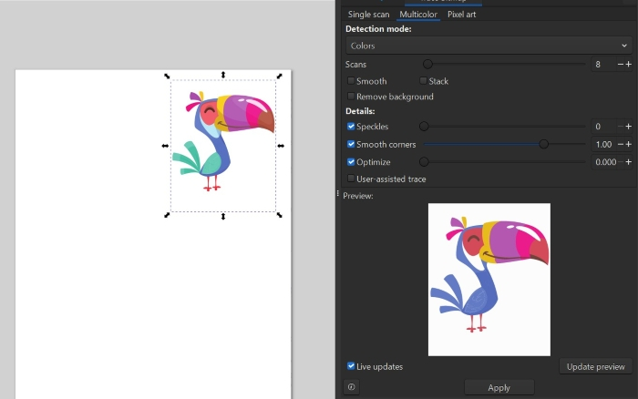
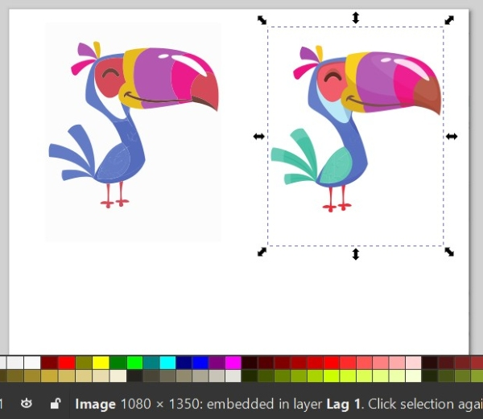
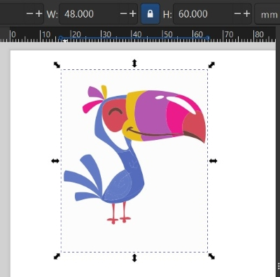
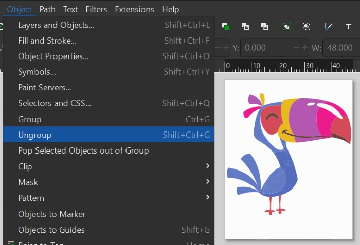
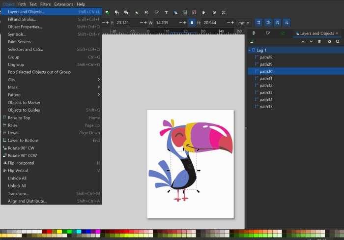
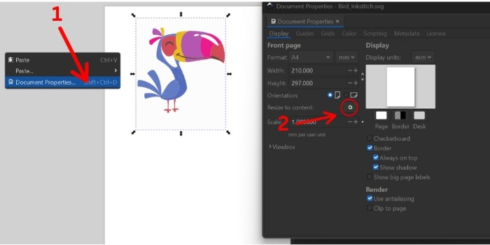
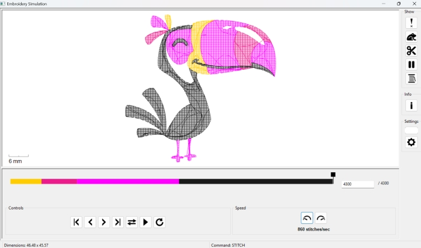
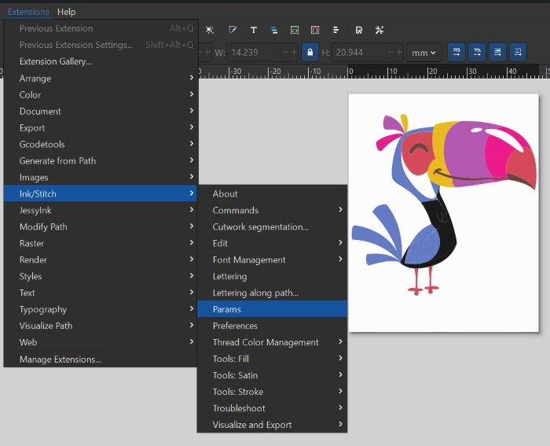
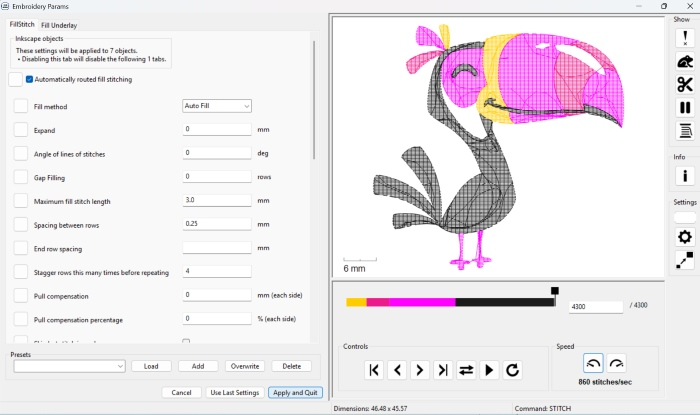
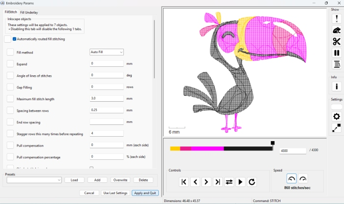

# Embroidery

## About the workshop

This workshop was mostly in Karen´s hands. She began by teaching others how to prepaire files and use the embroidery machine. Later on the participants assisted others. This was a flowing workshop throughout the whole bootcamp. 

Last year we had the Icelandic bootcamp in Húsavík and we also had an embroidery workshop there. Anna Reneau and Ólöf covered some of the basics there. See [link here](https://fab-lab-island.github.io/fli-bootcamp-2025/verkefnavinna/Saumavel/). Some of the documentation here below is based on information from this site.

## The embroidery machine

!!!note "Brother PR680W 6-Needle embroidery machine"

    The [Brother PR680W 6-Needle embroidery machine](https://sewingcraft.brother.eu/en/products/machines/semi-pro-embroidery-machines/semi-pro-embroidery-machines/pr680w) machine was used to embroider caps.

### Brochure, directions and download

!!! info "Brochure for Brother 6-needle embroidery machine"
    
    Fab Lab Húsavík has a Brother 6-needle embroidery machine. Here is the [brochure](https://download.brother.com/welcome/doch102285/884t23_om01en.pdf) for the Brother 6-needle embroidery machine. 

!!! tip "A drop of oil before each use"
    
     It is important to put a drop of oil onto the hook before inserting the bobbin case. This has to be done each day that the machine will be used.

!!! info "Download and instructions"
    
    The Inkstitch extension can be downloaded from [here](https://inkstitch.org/docs/install/). 
    
    [Here](https://www.brother-usa.com/products/pr680w?srsltid=AfmBOooVz6D1Qg1xH7Wp5b3vJmmYAfjZst4mKufn2EUSffsu4XYdvi7v) you can find instructions on how to use the machine.

## Workflow

!!!info "Different workflows"

    Some used the [PE-Design](https://www.brother-usa.com/products/pedesign11) while others used the [InkStitch extension](https://inkstitch.org/) in Inkscape to prepare a design for embroidery.

### Inkstitch used

!!! info "Creating a image for the embroidery machine"
    
     * Open the Inkscape program. 
     * Choose **File** -> **Upload**.
     * Choose the image you want to upload and click on **OK**.
   
!!! info "Trace bitmap with multicolor"
    
     * Choose **Path** -> **Trace bitmap**.
     * Click on the middle option: **Multicolor**.
     * Click on **Apply**.
     * Under **Detection mode** and choose **Color**.
     
    

!!! info "Delete the original image"
    
     * The program has created a vector drawing that lays on top of the original. Drag the image to one side, so that the other one appears. 
     * Delete the original image.

     
 
!!! info "Fill on and Stroke paint off (for filled areas)"
    
     * Next you click on **Object** -> **Fill and stroke**.
     * Turn **Fill** on and turn off **Stroke paint**.

!!! info "Fill off and Stroke paint on (for lines)"
    
     * If you want to stitch lines you have to turn on the stroke and make the line thicker.
     * Click on **Object** -> **Fill and stroke**.
     * Turn **Fill** off and turn on **Stroke paint**.
     * Convert the line to satin by choosing: **Extensions** -> **Ink/Stitch** -> **Tools: Satin** -> **convert line to satin**.
     * Minimum thickness of the satin line is 1.5mm but it is ideal to set it to 2mm or more.

!!! info "Determine the size"
    
     * Set the size of the image.
     * The maximum size for images on caps is 130mm wide and 60mm height.

     

!!! info "Change the colors now in Inkscape og later in the embroidery machine?"
    
     * You can either choose colors for the image there or later, in the embroidery machine.

!!! info "Ungroup if you want to edit colors in Inkscape"
    
     * If you want to change some of the colors you have to ungroup the image.
     * Choose **Object** -> **Ungroup**.

    

!!! info "Layers"
    
     * Choose **Object** -> **Layers**. 
     * Note that the embroidery machine will begin by sewing the bottom layer and then work upwards. Arrange the layers by dragging them up or down according to which layer you want to be embroidered first and last.

     

!!! info "Resize the working area"
    
     * Click on **File** and **Document properties**.
     * Click on the small button for resizing the page to content.

    

!!! tip "Preview your work"
    
     * Check out how the preview of your work by choosing **Extensions** -> **InkStitch** -> **Visualize and export** -> **Simulator**.

     

!!! warning "Save now!"
    
     * BEGIN BY CHOOSING **FILE** -> **SAVE**. This is because the program sometimes becomes unresponsive in the next step.
     
!!! info "Settings and preview params"
    
     * Then choose **Extensions** -> **InkStitch** -> **Params**.
     * Note that it will open up in another window. 
     * Also note that this will take time to open up.

    

!!! info "Settings and preview params"
    
    * In params you can see a preview of the path that will be embroidered. 
    * You can also adjust settings.
    * When you are satisfied, click on **Apply and quit**.

     

     * The embroidery takes longer time when you switch often between colors, so it is better to rearrange the layers so that layers with the same colors are side by side. See the new arrangement here below. Compare the two color bars.

       

!!! info "A .pes file"
    
    * Click on **File** -> **Save as**.
    * Save it as a .pes file.
    * Use a memory stick to transport the .pes file into the embroidery machine.

!!! warning "Do not save the .pes file until at the end"
    
     * It can be a problem to edit a .pes file after it has been saved, so save it after you have made all changes and saved the file as an .svg file first.

## Example of cap

