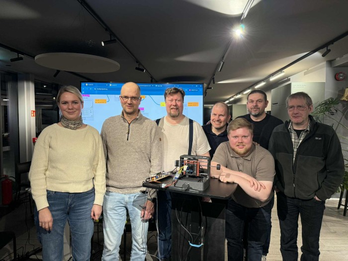
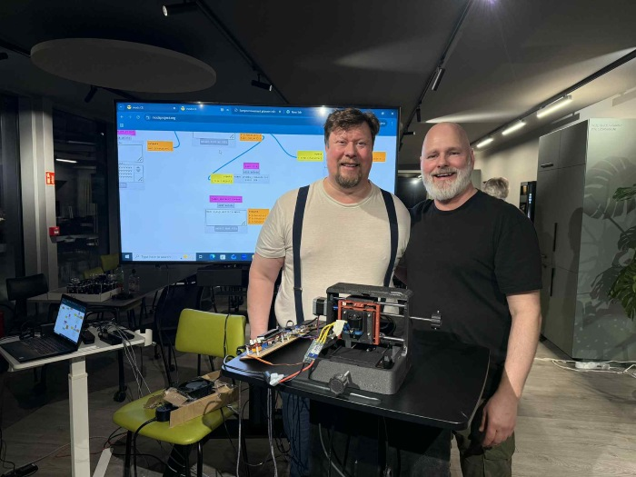
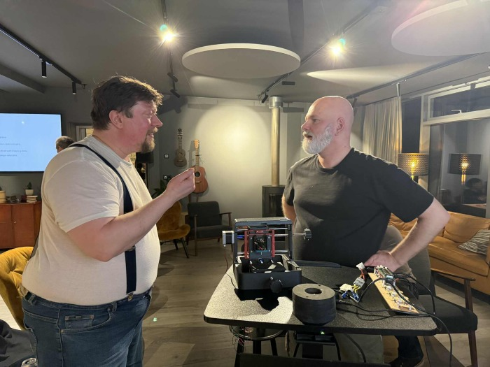
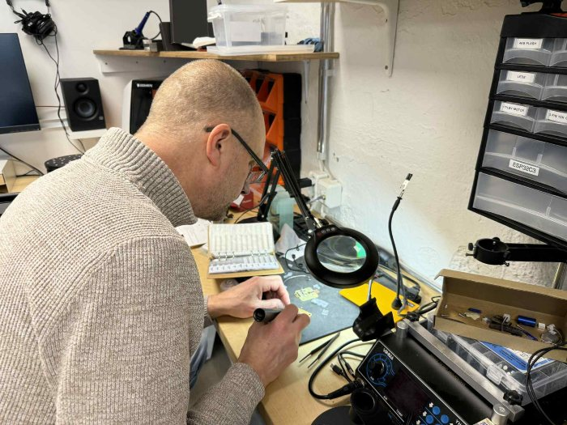

# Sampo milling system

## About the project

Janni from Super Fab Lab Olulu made a 3D-printed milling machine with the assistance of the group that you can see in the image above. When the machine was ready, Janni gave it Fab Lab Húsavík.

More about the Sampo milling system [here](https://gitlab.com/fab-lab-oulu/sampo) 

