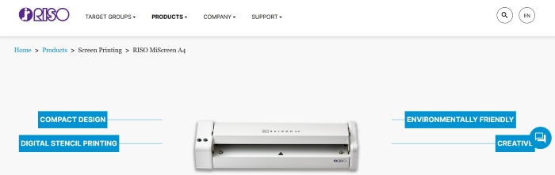

# Silkscreen printing

## About the workshop

The workshop began with a 2 hours program where Lars Beck Johannsen taught the process. Then it was ongoing throught the bootcamp. 

## MiScreen A4

!!!note "The machine"

    In this workshop the [MiScreen a4](https://www.risoprinter.de/en/products/screen-printing/riso-miscreen-a4) machine was used to create the silkscreen.

    

## Workflow

!!!success "Resolution"

    The resolution of the image to be used has to be set to 203 DPI when using the MiScreen A4 machine. The file format to be used can for example be .jpg, .jpeg, .png, .bmp and .pdf.

!!!note "Dithering or not"

    When an image is not dithered the print will give you a simple, flat surface. When you use some type of dithering you get different textures, f.ex. like the texture of a newsprint paper. If the image is in grayscale and you want the shading to appear on the print, you have to dither the image.

### Step 1

!!!note "Changing the resolution and using grayscale"

    The process can differ depending on which program you use to process the images. You can use Photoshop to change an image to greyscale and export it in 203 DPI. Here below is an example using Inkscape for changing the resolution:

    * Find an image that you want to use

    * Upload it into Inkscape.

    * Click on the image to select it.

    * Right-click on the screen and choose **Document properties**.

    * Click on **Resize to content**.

    * Choose **File** and then **Export**.

    * Choose the .png format.

    * Choose the folder you want to export the image to.
    
    * Change the DPI to 203 and finally you click on **Export**.

### Step 2
    
!!!note "Dithering"

    The Gimp program can be used to dither an image. 

    * Open the image in Gimp

    * Click on **Image**, then **mode** and then **Indexed**. 

    * Then you choose the **Use black and white (1-bit) palette** setting.
    
    * Choose the type of dithering you want, for example **Floyd-Steinberg (normal)**.

    * Click on the **convert** button.

    * Choose **File** and then **Export as**. Choose the .png format for exporting.

    

!!!note "Different way to dither"

    * Use Gimp

    * Choose **Filters** -> **Distortion** -> **Newsprint**.

    * Choose between differents shapes of filters. The cirkle gives you a newspaper look. The size of the shape will also give different results. 

    

### Step 3
    
!!!note "Prepairing the image for Miscreen A4"

    The [MiScreen A4 program](https://www.risoprinter.de/en/products/screen-printing/riso-miscreen-a4) is used to prepare the images.

    * Drag your image onto the working plane in the program.

    * Click on **Send the...**.

!!!note "Fastening the silkscreen"

    * Put double-tape on the frame.
    
    * Fasten the silkscreen on the double-tape. Make sure that it is well stretched.    

    * Place the frame in the machine. Make sure that the frame falls in the right place.

    * Press firmly on top of the machine. Hold the pressure until the machine has stopped.

      

### Step 4

!!!note "Silkscreen printing"

    * Use tape to fasten paper onto the plexiglass base.
    
    * Place the frame with the silkscreen on the plexiglass base.

    * Add paint in a line onto the silkscreen above the area to be printed.

    * Use firm pressure when dragging the paint across the area. IMPORTANT!:
    This should only be done in one movement. The results will not be as good if you go more than once over the area.

    * Remove the frame quickly, so that the paint won´t dry with the frame on top of the image.

