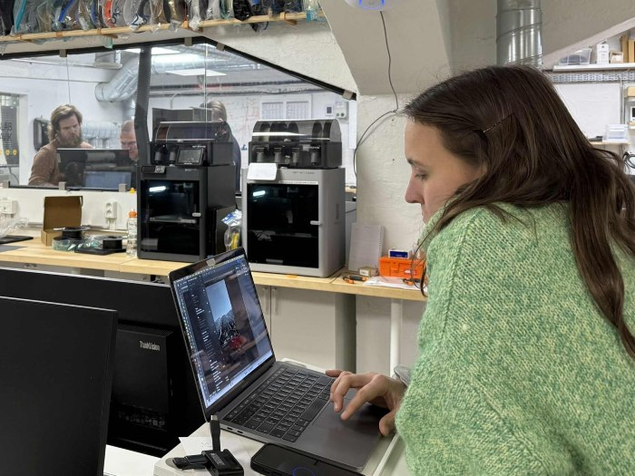
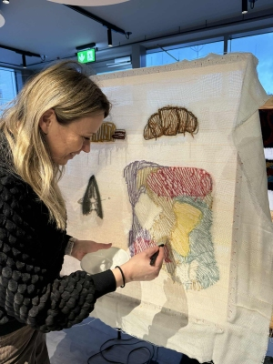

# Tufting

## About the workshop

!!!note "About"

    Chiara Alissa Estivariz Lopez from the Textile center in Blönduós ran the workshop. The participants learned how to use tufting guns to create textile projects.

    

## Workflow

!!!note "The process"

    Tufting is a fast and expressive textile technique, but it also requires patience and practice. While working you need consistent pressure, appropriate speed of the gun, steady movement, and proper fabric tension. If you keep this in mind and found your own workflow you can ensure clean lines and an even surface. Mistakes are easy to fix by pulling out yarn and re-tufting, stretching the canvas again, making sure you keep the tufting gun on 90° to the canvas, and keep the pressure into the canvas steady.
    
    In this tufting course the group got hands-on with the tufting gun and learned how to work with both cut and loop settings of the tufting guns. Each technique creates a distinct surface texture, opening up endless creative possibilities. Both settings are ideal for rug making and textile art. Also, for creating more depth and texture both settings can be combined in one piece. 
    
    Everyone got one frame and space to draw their own graphics and illustrations and bring them to life with yarn. Along the way, they learned how to wind bobbins correctly, a necessary step for smooth and consistent tufting. After tufting, each piece was glued to secure the yarn, then carefully removed from the frame, and trimmed. For further finishings, the cut off pieces can then be backed with another fabric at home and stitched together. One can use felt, fabric or cardboard to fix the piece and hide the backside where the glue will be hardening the yarn and canvas a lot.

## More info

!!!note "How to buy your own"

    For those interested in tufting at home, it is important to have a sturdy frame, tightly stretched tufting fabric, and enough space to work comfortably. Tufting guns are powerful tools, so safety is essential. Always keep fingers away from the needle area and switch off the machine when adjusting yarn or settings. Proper ventilation is recommended when applying glue, and allowing enough drying time ensures a durable final piece.

    With the right setup and a bit of practice, tufting at home can be super fun to create custom rugs, wall pieces, and experimental textile artworks.

    You can purchase tufting kits via:

    The [Tuft the world](https://tufttheworld.com/) 

    The [Tufting shop](https://tuftingshop.com/) 

## Projects

  

## Contact the Textile center

!!!note "Contact info"

    If you want to contact Alissa the email is textillab@textilmidstod.is 